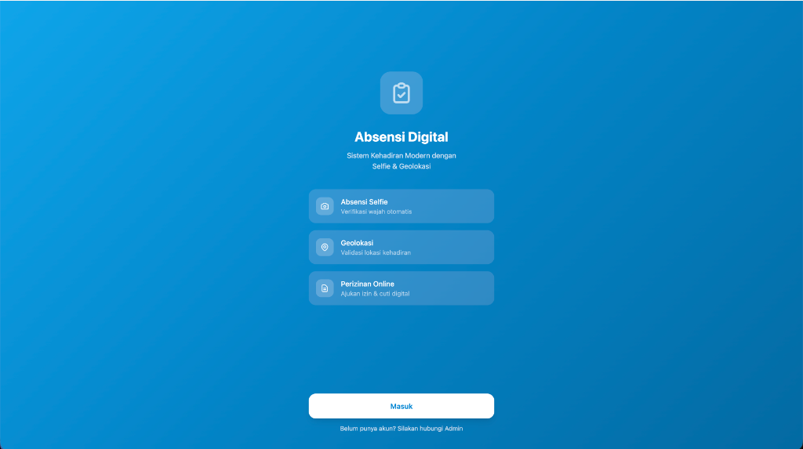
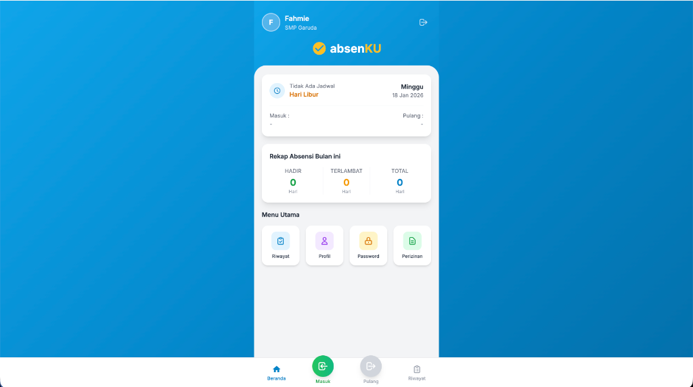

# 📋 AbsenKU - Sistem Absensi Digital

<p align="center">
  
  
</p>

---

## 📖 Tentang Aplikasi

**AbsenKU** adalah sistem kehadiran modern yang menggunakan teknologi **Selfie** dan **Geolokasi** untuk memvalidasi absensi. Aplikasi ini dirancang untuk memudahkan pengelolaan kehadiran karyawan/siswa dengan fitur-fitur canggih dan antarmuka yang modern.

### ✨ Fitur Utama

- 📸 **Absensi Selfie** - Verifikasi wajah otomatis saat absensi
- 📍 **Geolokasi** - Validasi lokasi kehadiran menggunakan GPS
- 📄 **Perizinan Online** - Ajukan izin & cuti secara digital
- 📊 **Rekap Absensi** - Laporan kehadiran bulanan (Hadir, Terlambat, Total)
- 🏢 **Multi Kantor/Lokasi** - Dukungan untuk beberapa lokasi kerja
- 📅 **Jadwal Kerja** - Pengaturan jadwal masuk dan pulang
- 📆 **Tahun Akademik** - Manajemen periode akademik
- 👥 **Manajemen User** - Pengelolaan data pengguna dengan role

---

## 🛠️ Teknologi

- **Framework**: Laravel 12
- **Frontend**: Blade + AlpineJS
- **Database**: MySQL/SQLite
- **CSS**: Custom CSS
- **Icons**: Font Awesome, Blade Icons

---

## 🚀 Cara Clone & Instalasi

### Persyaratan Sistem

- PHP >= 8.2
- Composer
- Node.js & NPM
- MySQL atau SQLite

### Langkah-langkah Instalasi

1. **Clone Repository**

    ```bash
    git clone https://github.com/USERNAME/absensi-selfie-geo.git
    cd absensi-selfie-geo
    ```

2. **Install Dependencies PHP**

    ```bash
    composer install
    ```

3. **Install Dependencies Node.js**

    ```bash
    npm install
    ```

4. **Konfigurasi Environment**

    ```bash
    cp .env.example .env
    php artisan key:generate
    ```

5. **Konfigurasi Database**

    Edit file `.env` dan sesuaikan konfigurasi database:

    ```env
    DB_CONNECTION=mysql
    DB_HOST=127.0.0.1
    DB_PORT=3306
    DB_DATABASE=absensi_db
    DB_USERNAME=root
    DB_PASSWORD=
    ```

    Atau gunakan SQLite (lebih mudah untuk development):

    ```bash
    touch database/database.sqlite
    ```

    Lalu ubah `.env`:

    ```env
    DB_CONNECTION=sqlite
    ```

6. **Jalankan Migrasi Database**

    ```bash
    php artisan migrate
    ```

7. **Build Assets**

    ```bash
    npm run build
    ```

8. **Jalankan Server Development**

    ```bash
    # Terminal 1 - Laravel Server
    php artisan serve

    # Terminal 2 - Vite Development Server
    npm run dev
    ```

9. **Akses Aplikasi**

    Buka browser dan akses: `http://localhost:8000`

---

## 📁 Struktur Direktori

```
absensi-selfie-geo/
├── app/
│   ├── Http/Controllers/    # Controller aplikasi
│   ├── Models/              # Model Eloquent
│   ├── Services/            # Business logic
│   └── ...
├── database/
│   ├── migrations/          # File migrasi database
│   └── seeders/             # Data seeder
├── resources/
│   ├── views/               # Blade templates
│   ├── css/                 # Stylesheet
│   └── js/                  # JavaScript files
├── routes/
│   └── web.php              # Route definitions
└── ...
```

---

## 📊 Model Database

| Model          | Deskripsi              |
| -------------- | ---------------------- |
| `User`         | Data pengguna/karyawan |
| `Attendance`   | Record kehadiran       |
| `Leave`        | Data perizinan/cuti    |
| `Office`       | Lokasi kantor          |
| `WorkSchedule` | Jadwal kerja           |
| `WorkSetting`  | Pengaturan kerja       |
| `AcademicYear` | Tahun akademik         |
| `Role`         | Hak akses pengguna     |

---

## 🤝 Kontribusi

Kontribusi selalu diterima! Silakan buat Pull Request atau buka Issue jika menemukan bug.

---

## 📄 Lisensi

Proyek ini dilisensikan di bawah [MIT License](LICENSE).

---

## 👨‍💻 Developer

Dikembangkan dengan ❤️ menggunakan Laravel
</CodeContent>
<parameter name="EmptyFile">false
